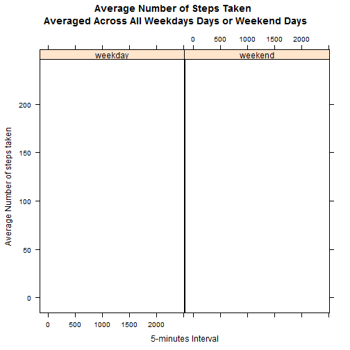

```r
sessionInfo()
```

```
## R version 3.2.1 (2015-06-18)
## Platform: i386-w64-mingw32/i386 (32-bit)
## Running under: Windows 7 (build 7601) Service Pack 1
## 
## locale:
## [1] LC_COLLATE=French_France.1252  LC_CTYPE=French_France.1252   
## [3] LC_MONETARY=French_France.1252 LC_NUMERIC=C                  
## [5] LC_TIME=French_France.1252    
## 
## attached base packages:
## [1] tcltk     stats     graphics  grDevices utils     datasets  methods  
## [8] base     
## 
## other attached packages:
##  [1] knitr_1.11      lattice_0.20-31 sqldf_0.4-10    RSQLite_1.0.0  
##  [5] DBI_0.3.1       gsubfn_0.6-6    proto_0.3-10    plyr_1.8.3     
##  [9] ggplot2_1.0.1   installr_0.17.0
## 
## loaded via a namespace (and not attached):
##  [1] Rcpp_0.12.0       magrittr_1.5      MASS_7.3-40      
##  [4] munsell_0.4.2     colorspace_1.2-6  highr_0.5        
##  [7] stringr_1.0.0     tools_3.2.1       grid_3.2.1       
## [10] gtable_0.1.2      htmltools_0.2.6   yaml_2.1.13      
## [13] digest_0.6.8      formatR_1.2       reshape2_1.4.1   
## [16] rsconnect_0.4.1.2 mime_0.3          evaluate_0.7.2   
## [19] rmarkdown_0.8     labeling_0.3      stringi_0.5-5    
## [22] scales_0.2.5      markdown_0.7.7    chron_2.3-47
```


```
## [1] "C:/Users/ephyto/Google Drive/coursera - Data Science Specialization/5 Reproducible Research/week 2 assignment/repdata-data-activity"
```

```r
data <- read.csv("activity.csv")

#convert date to data type
data$date <- as.Date(data$date)
dim(data)
```

```
## [1] 17568     3
```

```r
names(data)
```

```
## [1] "steps"    "date"     "interval"
```
###Q1: what is mean total number of steps per day

create new dataset without na values

```r
data.ignore.na <- na.omit(data)
daily.steps <- rowsum(data.ignore.na$steps, format(data.ignore.na$date, '%Y-%m-%d'))
daily.steps <- data.frame(daily.steps)
names(daily.steps) <- ("steps")

#meanTotalSteps <- aggregate(nactivity$steps, list(nactivity$date), sum)
#names(meanTotalSteps) <- c("date", "steps")
#meanTotalSteps
```
mean line in magenta, median line in blue, median=mean in our example

```r
lmts <- nrow(daily.steps)
hist(daily.steps$steps, breaks=lmts)
rug(daily.steps$steps)
abline(v=mean(daily.steps$steps), col="magenta", lwd=4)
abline(v=median(daily.steps$steps), col="blue", lwd=1)
```

 

```r
mean(daily.steps$steps)
```

```
## [1] 10766.19
```

```r
median(daily.steps$steps)
```

```
## [1] 10765
```

###What is the average daily activity

```r
library(plyr)
#calculate average steps for each of 5-minute inteval during a 24-hour period
interval.mean.steps <- ddply(data.ignore.na, ~interval, summarise, mean=mean(steps))
```

```r
library(ggplot2)
qplot(x=interval, y=mean, data = interval.mean.steps, geom = "line", xlab="5 minutes inteval", ylab="Number of Step Count", main="Average Number of Steps Across All Days"
)
```

 

Report 5-min interval, on average across all the days in the dataset, contains the maximum number of steps


```r
interval.mean.steps[which.max(interval.mean.steps$mean),]
```

```
##     interval     mean
## 104      835 206.1698
```

**Observations**

Based on steps taken pattern, the person's daily activity peaks around 8:35am

###Imputing missing values

Calculate and report the total number of missing values in the dataset


```r
library(sqldf)
```
```
tNA <- sqldf('SELECT d.* 
        FROM "data" as d
        WHERE d.steps IS NULL 
        ORDER BY d.date, d.interval')
``


```r
#NROW(tNA)
```

Filling the missing values


```r
t1 <- sqldf('
        SELECT d.*, i.mean 
        FROM "interval.mean.steps" as i 
        JOIN "data" as d 
        ON d.interval = i.interval 
        ORDER BY d.date, d.interval ')

t1$steps[is.na(t1$steps)] <- t1$mean[is.na(t1$steps)]
```

Prepare data for plot histogram


```r
t1.total.steps <- as.integer( sqldf('
        SELECT sum(steps) 
        FROM t1') )
        
t1.total.steps.by.date <- sqldf('
        SELECT date, sum(steps) as "t1.total.steps.by.date" 
        FROM t1 GROUP BY date 
        ORDER BY date')
        
daily.61.steps <- sqldf('
        SELECT date, "t1.total.steps.by.date" as "steps" 
        FROM "t1.total.steps.by.date" 
        ORDER BY date')
```

Make an histogram of the total number of steps every day


```r
hist(daily.61.steps$steps,
        main=" ", 
        breaks=10, 
        xlab="After Imputate NA -Total Number Of Steps Taken Daily")
```

 

Calculate and report the mean and median total number of steps taken per day


```r
t1.mean.steps.per.day <- as.integer(t1.total.steps / NROW(t1.total.steps.by.date))
t1.mean.steps.per.day
```

```
## [1] 10766
```


```r
t1.median.steps.per.day <- median(t1.total.steps.by.date$t1.total.steps.by.date)
t1.mean.steps.per.day
```

```
## [1] 10766
```
**Observation**

Do these values (mean and median) differ from the estimates from the first part of the assignment? Not really

What is the impact of imputing missing value on the estimates of the total daily number of steps? The shape of the histogram remains the same as the histogram from removed missing values. However, the frequency counts increased as expected.

###Are there differences in activity patterns between weekdays and weekends?

Use the dataset with the filled-in missing values for this part. Create a new factor variable with two levels -"weekday" and "weekend" indicating whether a given date is a weekday or weekend day.

Make  a panel plot containing a time series plot (i.e. type="|") of the 5-minutes interval (x axis) and the average number of steps taken, averaged accross all weekday days or weekend days (y-axis)


```r
t1$dateday <- format(t1$date, "%A")
t1$weektime <- as.factor(ifelse(weekdays(t1$date) %in%
        c("samedi", "dimanche"), "weekend", "weekday"))
        
t5 <- sqldf('
        SELECT interval, avg(steps) as "mean.steps", weektime             
        FROM t1 
        GROUP BY weektime, interval 
        ORDER BY interval')
```


```r
library(lattice)
p <- xyplot(mean.steps ~ interval | factor(weektime), data=t5, 
        type = "|", 
        main = "Average Number of Steps Taken \n Averaged Across All Weekdays Days or Weekend Days", 
        xlab = "5-minutes Interval",
        ylab = "Average Number of steps taken"
        )
print(p)
```

 

